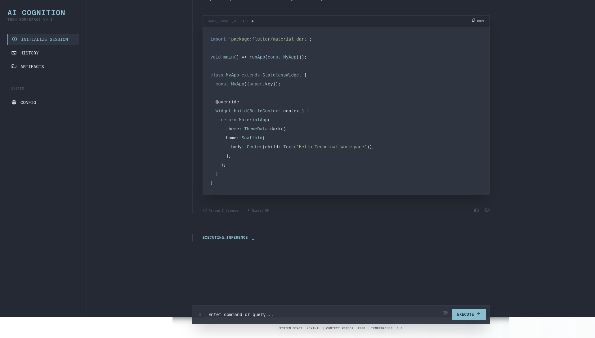

# LLM Council

A multi-agent system that routes user prompts to the most suitable specialized language model, instead of relying on a single model for every task.

## How it works

1. **Prompt Enhancer** — a fine-tuned LFM2.5 model ([`Mouryace200405/lfm2.5-prompt-enhancer`](https://huggingface.co/Mouryace200405/lfm2.5-prompt-enhancer)) rewrites the raw user prompt into a clearer, more detailed version.
2. **Prompt Classifier** — [`nvidia/prompt-task-and-complexity-classifier`](https://huggingface.co/nvidia/prompt-task-and-complexity-classifier) analyzes the enhanced prompt and outputs a task type plus complexity scores (reasoning, creativity, domain knowledge, contextual knowledge, constraints).
3. **Routing Decision** — a rule-based router uses the classifier's scores to pick the best model from the council. No separate router model is trained; routing is purely threshold-based on the classifier output.
4. **Council Model** — the selected model generates the final response.

## Council models

| Role | Model |
|---|---|
| Coder | `Qwen/Qwen2.5-Coder-7B-Instruct` |
| Vision | `openbmb/MiniCPM-V-4_5` |
| Long context | `Qwen/Qwen3.5-9B` |
| General | `LiquidAI/LFM2.5-8B-A1B` |

*  --> **The application is still in early stages of develop this repo is jsu the front end and will be merged to backend on beta release**

## Note

- The enhancer and classifier are small enough to run locally on a 6GB GPU.
- Council models (7–9B each) are loaded lazily — only the model selected by routing is loaded into memory.
- Primary evaluation metric is energy/power efficiency: avoiding unnecessary use of large models for simple tasks.

